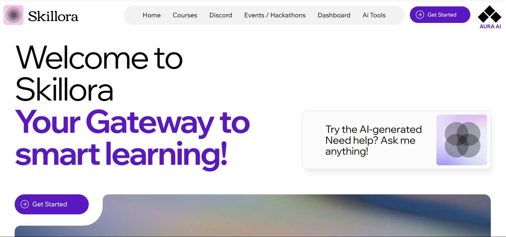

# Skillora

Skillora is a dynamic online learning platform designed to provide coding-related courses. Built using the MERN stack, it offers a seamless experience for students, instructors, and administrators.
## 🖼 Website Preview



## Features

### For Students
- **User Authentication**: Secure login and registration.
- **Course Catalog**: Browse and enroll in various coding courses.
- **Progress Tracking**: Monitor your learning journey.

### For Instructors
- **Course Management**: Create and manage your courses.
- **Student Interaction**: Engage with students through discussions and feedback.

### For Admins
- **User Management**: Oversee student and instructor accounts.
- **Content Moderation**: Ensure quality and relevance of course materials.

## Tech Stack

- **Frontend**: React.js
- **Backend**: Node.js with Express.js
- **Database**: MongoDB
- **Authentication**: JWT (JSON Web Tokens)
- **Styling**: Tailwind CSS

## Installation

1. Clone the repository:
   ```bash
   git clone https://github.com/adityachiluveru/Skillora.git
   cd Skillora
